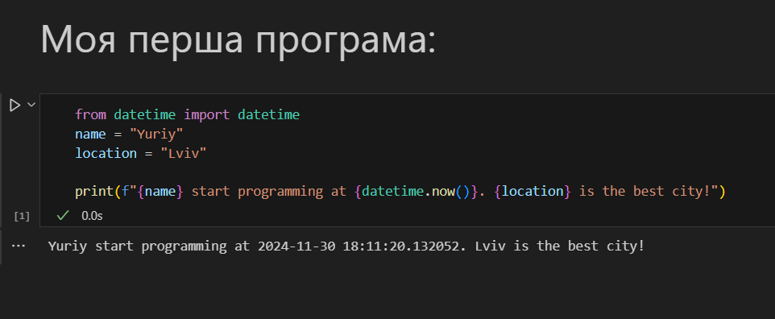

# Звіт до лабораторної роботи № 1
## Тема: оформлення робіт та перша програма
### Мета роботи: налаштувати середовище, створити репозиторій, попрацювати з Markdown та оформити звіт.

---
## Виконання роботи
* ### Результати виконання завдань:
    1. Створив репозиторій, оформив його.
    1. Навчився працювати із репозиторієм, налаштував інтеграцію з Visual Studio Code;
    1. Написав першу програму Python та [запустив її](./main.py). Результат на скріні:
    

    1. Написав другу та третю програму Python та [запустив її](./main.ipynb). Результат на скріні:
    

---

## Висновок:

- Отже, у цій роботі було створено та оформлено репозиторій.
- У цій роботі я ознайомився із форматуванням Markdown. 
- Досягнув мету роботи: налаштувати середовище, створити репозиторій, попрацювати з Markdown та оформити звіт.

---
⠀⠀⠀⠀