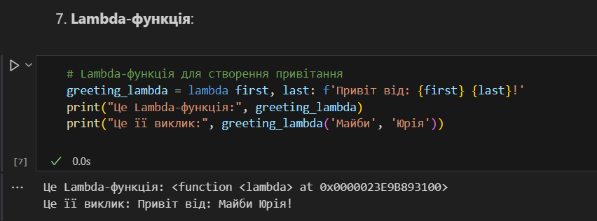

# Звіт до лабораторної роботи № 2
## Тема: Основи програмування на Python  
### Мета роботи: Ознайомитися з основними конструкціями та можливостями Python.

---

## Виконання роботи

* ### Результати виконання завдань:
    1. Створив файл із [базовими прикладами Python-коду](./main.ipynb) для ознайомлення з типами даних та основними конструкціями;
    1. Попрацював із Python-циклами, такими як `for`, `while`;
    1. Навчився використовувати Python-конструкції `if`, `try-except`;
    1. Використав Python-менеджер `with` для роботи з файлами;
    1. Створив Python-Lambda-функцію. Результат на скріні:
    

---

## Висновок:

- Отже, у цій роботі були виконані базові вправи для ознайомлення з конструкціями мови Python.
- Досягнув мету роботи: ознайомитися з основами Python та отримати практичний досвід роботи з базовими типами даних, циклами, розгалуженнями, обробкою помилок та контекст-менеджерами.

---